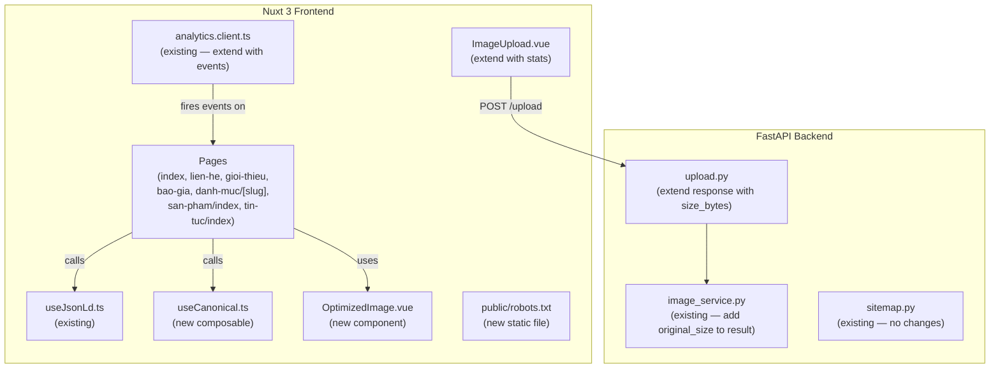

# Design: SEO & Performance Optimization

## Overview

This document covers the technical design for the remaining SEO and performance work on the Newnice automotive window film website. The backend sitemap endpoint and image optimization pipeline are already implemented, as are the JSON-LD helper composables and the GA4 plugin skeleton. What remains is wiring these pieces into the pages that still lack them, adding GA4 conversion event tracking, building the `OptimizedImage.vue` component, surfacing upload optimization feedback in the admin, adding `robots.txt`, and ensuring every page has a canonical URL.

The work is entirely frontend-focused except for one minor backend addition: returning file-size metadata from the upload endpoint so the admin UI can display optimization results.

---

## Architecture



The design follows the existing patterns: composables for head/meta logic, page-level `<script setup>` for wiring, and a single analytics plugin that exposes `$gtag`.

---

## Components and Interfaces

### 1. `useCanonical.ts` — new composable

A thin wrapper around `useHead` that injects a `<link rel="canonical">` tag. Every page calls this once with its path.

```typescript
// frontend/composables/useCanonical.ts
export function useCanonical(path: string) {
  const config = useRuntimeConfig()
  const siteUrl = (config.public.siteUrl as string).replace(/\/$/, '')
  useHead({
    link: [{ rel: 'canonical', href: `${siteUrl}${path}` }],
  })
}
```

For dynamic pages (e.g. product slug), the path is derived from `useRoute().path` so it is always the canonical SSR-rendered URL.

---

### 2. `OptimizedImage.vue` — new component

Renders a `<picture>` element using the WebP variants produced by `image_service.py`. Falls back to the original URL for browsers without WebP support. Supports lazy loading via the native `loading` attribute.

**Props:**

| Prop | Type | Default | Description |
|------|------|---------|-------------|
| `src` | `string` | required | Original image URL (fallback) |
| `srcset` | `string` | `''` | Comma-separated srcset string from image service |
| `sizes` | `string` | `'100vw'` | Sizes hint for the browser |
| `alt` | `string` | required | Alt text (required for SEO/a11y) |
| `loading` | `'lazy' \| 'eager'` | `'lazy'` | Native loading attribute |
| `class` | `string` | `''` | CSS classes forwarded to `` |
| `width` | `number` | `undefined` | Explicit width (prevents CLS) |
| `height` | `number` | `undefined` | Explicit height (prevents CLS) |

**Template structure:**

```html
<picture>
  <!-- WebP source when srcset is provided -->
  <source v-if="srcset" type="image/webp" :srcset="srcset" :sizes="sizes" />
  <!-- Fallback img -->
  
</picture>
```

**Usage in product card / gallery:**

```html
<OptimizedImage
  :src="product.thumbnail"
  :srcset="product.thumbnail_srcset"
  sizes="(max-width: 640px) 100vw, (max-width: 1024px) 50vw, 320px"
  :alt="product.name"
  loading="lazy"
  class="w-full h-full object-cover"
/>
```

The `thumbnail_srcset` field is populated by the backend when a product image is uploaded. If it is absent (legacy images), the component degrades gracefully to a plain ``.

---

### 3. `ImageUpload.vue` — extend existing component

After a successful upload the component already emits an `uploaded` event with the full `ImageData` object. The extension adds an optimization stats panel below the preview.

**New display (shown after upload, hidden otherwise):**

```
✓ Optimizado: 2.4 MB → 380 KB  (84% nhỏ hơn)
  Variants: thumb, small, medium, large, xlarge
```

The stats are derived from the `original_size_bytes` and `webp_size_bytes` fields added to the upload response (see backend change below). No new props are needed — the data comes through the existing `uploaded` event payload.

---

### 4. GA4 event tracking — extend `analytics.client.ts`

The plugin already exposes `$gtag`. The conversion events are fired from the form components and product page directly, not from the plugin itself. The plugin provides the `$gtag` helper; each component calls it at the right moment.

**Events to implement:**

| Event name | Where fired | Key parameters |
|---|---|---|
| `generate_lead` | `QuoteForm.vue` on successful submit | `form_type: 'quote'` |
| `contact` | `ContactForm.vue` on successful submit | `form_type: 'contact'` |
| `phone_click` | Any `tel:` link click | `phone_number` |
| `view_item` | `san-pham/[slug].vue` on mount | `item_id`, `item_name`, `item_category`, `item_brand` |
| `filter_products` | `ProductFilters.vue` / filter sidebar on change | `filter_type`, `filter_value` |

The `phone_click` event is best handled via a shared `usePhoneTracking()` composable so all `tel:` links across the site fire it consistently without duplicating code.

```typescript
// frontend/composables/usePhoneTracking.ts
export function usePhoneTracking() {
  const { $gtag } = useNuxtApp()
  return {
    trackPhoneClick(phoneNumber: string) {
      $gtag('event', 'phone_click', { phone_number: phoneNumber })
    },
  }
}
```

---

### 5. JSON-LD on remaining pages

Pages that need Organization/LocalBusiness schema added:

| Page | Schema to add |
|------|--------------|
| `index.vue` | `buildOrganizationSchema()` |
| `lien-he.vue` | `buildLocalBusinessSchema()` |
| `gioi-thieu.vue` | `buildOrganizationSchema()` |

Pages that need breadcrumb schema added:

| Page | Breadcrumb path |
|------|----------------|
| `danh-muc/[slug].vue` | Home → Sản phẩm → {category.name} |
| `san-pham/index.vue` | Home → Sản phẩm |
| `tin-tuc/index.vue` | Home → Tin tức |

Static pages that need improved `useSeoMeta()` with Vietnamese keywords:

| Page | Title | Description |
|------|-------|-------------|
| `gioi-thieu.vue` | already has it | already has it |
| `lien-he.vue` | `Liên hệ Newnice — Tư vấn phim cách nhiệt ô tô tại TP.HCM` | `Liên hệ Newnice để được tư vấn miễn phí về phim cách nhiệt ô tô, phim PPF, phim đổi màu xe. Địa chỉ: 123 Nguyễn Văn Linh, Quận 7, TP.HCM. Hotline: 0901 234 567` |
| `bao-gia.vue` | `Báo giá phim cách nhiệt ô tô — Newnice` | `Nhận báo giá phim cách nhiệt ô tô, phim PPF, phim đổi màu xe miễn phí. Phản hồi trong 30 phút. Bảo hành lên đến 10 năm.` |

---

### 6. `public/robots.txt` — new static file

```
User-agent: *
Allow: /

Disallow: /admin/
Disallow: /api/

Sitemap: https://newnice.vn/sitemap.xml
```

Nuxt serves files from `frontend/public/` at the root path, so `frontend/public/robots.txt` is served at `/robots.txt`.

---

## Data Models

### Upload response extension (backend)

`image_service.py::save_upload()` currently returns a dict without file size information. Add two fields:

```python
result["original_size_bytes"] = len(content)          # size of the raw uploaded file
result["webp_size_bytes"] = webp_path.stat().st_size  # size of the root WebP conversion
```

The frontend `ImageData` interface gains two optional fields:

```typescript
interface ImageData {
  // ... existing fields ...
  original_size_bytes?: number
  webp_size_bytes?: number
}
```

No database schema changes are required — these are ephemeral response fields only.

### Canonical URL convention

All canonical URLs follow the pattern `{NUXT_PUBLIC_SITE_URL}{route.path}`. Query parameters and hash fragments are excluded. For paginated listing pages (`/san-pham?page=2`), the canonical always points to the base path (`/san-pham`) to consolidate link equity.

---

## Correctness Properties

*A property is a characteristic or behavior that should hold true across all valid executions of a system — essentially, a formal statement about what the system should do. Properties serve as the bridge between human-readable specifications and machine-verifiable correctness guarantees.*

### Property 1: Product schema contains required fields

*For any* product object with a name, slug, and at least one optional field, `buildProductSchema()` must return a JSON-LD object with `@type = "Product"`, a non-empty `name`, a `url` containing the slug, and an `offers` object with `priceCurrency = "VND"` and a valid `availability` URL.

**Validates: Requirements FR-2 (product structured data)**

---

### Property 2: Article schema contains required fields

*For any* post object with a title, slug, `created_at`, and `updated_at`, `buildArticleSchema()` must return a JSON-LD object with `@type = "Article"`, a non-empty `headline`, a `datePublished` value, and an `author` object with `@type = "Organization"`.

**Validates: Requirements FR-2 (blog article structured data)**

---

### Property 3: Breadcrumb positions are sequential and complete

*For any* non-empty array of breadcrumb items, `buildBreadcrumbSchema()` must return a `BreadcrumbList` whose `itemListElement` array has the same length as the input, with `position` values starting at 1 and incrementing by 1, and each `item` URL containing the corresponding input `url`.

**Validates: Requirements FR-2 (breadcrumb structured data)**

---

### Property 4: Canonical URL is always an absolute URL containing the path

*For any* page path string (e.g. `/san-pham/phim-3m`), `useCanonical()` must inject a `<link rel="canonical">` whose `href` starts with `https://` and ends with the exact path string.

**Validates: Requirements NFR-2 (canonical URLs / duplicate content prevention)**

---

### Property 5: OptimizedImage srcset contains all variant URLs

*For any* image data object returned by the upload service that contains `small`, `medium`, `large`, and `xlarge` variant URLs, the `srcset` string built from that data must contain each variant URL followed by its width descriptor (e.g. `320w`, `640w`, `1024w`, `1920w`).

**Validates: Requirements FR-3 (responsive images / srcset generation)**

---

### Property 6: Upload optimization reduction percentage is correct

*For any* upload result where `original_size_bytes > 0` and `webp_size_bytes > 0`, the displayed reduction percentage shown in `ImageUpload.vue` must equal `Math.round((1 - webp_size_bytes / original_size_bytes) * 100)` and must be between 0 and 100 inclusive.

**Validates: Requirements FR-3 (admin upload feedback)**

---

### Property 7: view_item event payload matches product data

*For any* product object, the GA4 `view_item` event fired on the product detail page must include `item_id` equal to `String(product.id)` and `item_name` equal to `product.name`.

**Validates: Requirements FR-4 (product view tracking)**

---

## Error Handling

### Missing image variants

If `srcset` is empty or absent, `OptimizedImage.vue` omits the `<source>` element and renders a plain `` with the `src` fallback. No error is thrown. This handles legacy images that were uploaded before the optimization pipeline was in place.

### GA4 not loaded

`$gtag` calls are guarded by the existing `typeof window !== 'undefined' && window.gtag` check in the plugin. If GA4 fails to load (ad blocker, network error), event calls are silently no-ops. The `usePhoneTracking` composable inherits this behavior.

### Upload size metadata missing

If `original_size_bytes` or `webp_size_bytes` are absent from the upload response (e.g. when `generate_variants = false`), the `ImageUpload.vue` stats panel is hidden. The component checks `imageData.original_size_bytes != null` before rendering the stats block.

### Canonical URL with missing siteUrl config

If `NUXT_PUBLIC_SITE_URL` is not set, `useCanonical` falls back to `http://localhost:3000` (the existing default in `nuxt.config.ts`). This is acceptable for development; production deployments must set the env var.

### JSON-LD on pages with missing data

All JSON-LD calls are guarded by the existing pattern (`if (product.value) { useJsonLd(...) }`). Organization and LocalBusiness schemas are static (no dynamic data), so they are always safe to call unconditionally.

---

## Testing Strategy

### Unit tests (Vitest + Vue Test Utils)

Focus on pure functions and component rendering logic:

- `useJsonLd.ts` — test each builder function with representative inputs and edge cases (missing optional fields, contact-price products, posts without thumbnails)
- `useCanonical.ts` — test that the correct `href` is injected for various path inputs
- `OptimizedImage.vue` — test that `<source>` is rendered when srcset is present and omitted when absent; test that `loading="lazy"` is the default
- `ImageUpload.vue` stats panel — test that the reduction percentage renders correctly and is hidden when size data is absent
- GA4 event helpers — mock `$gtag` and verify event names and payload shapes

### Property-based tests (fast-check)

Use [fast-check](https://fast-check.io/) (TypeScript-native PBT library). Each property test runs a minimum of 100 iterations.

Tag format: `// Feature: seo-performance-optimization, Property {N}: {property_text}`

**Property 1** — `buildProductSchema` completeness:
Generate arbitrary product objects (random names, slugs, optional price/brand/warranty). Assert `@type`, `name`, `url`, `offers.priceCurrency`, `offers.availability` are always present and correct.

**Property 2** — `buildArticleSchema` completeness:
Generate arbitrary post objects (random titles, slugs, ISO date strings). Assert `@type`, `headline`, `datePublished`, `author.@type` are always present.

**Property 3** — `buildBreadcrumbSchema` sequential positions:
Generate arrays of 1–10 breadcrumb items with random names and URL paths. Assert `itemListElement.length === input.length`, positions are `[1, 2, ..., n]`, and each `item` contains the input URL.

**Property 4** — `useCanonical` absolute URL:
Generate random URL path strings (starting with `/`). Assert the injected canonical `href` starts with `https://` and ends with the path.

**Property 5** — `OptimizedImage` srcset completeness:
Generate random image data objects with variant URLs. Assert the rendered `srcset` attribute contains each variant URL with its width descriptor.

**Property 6** — Upload reduction percentage:
Generate pairs of `(original_size_bytes, webp_size_bytes)` where both are positive integers and `webp_size_bytes <= original_size_bytes`. Assert the displayed percentage equals `Math.round((1 - webp / original) * 100)` and is in `[0, 100]`.

**Property 7** — `view_item` payload:
Generate random product objects. Assert the event payload's `item_id` and `item_name` match the product.

### Integration / smoke tests

- Verify `GET /robots.txt` returns 200 with `Sitemap:` directive (smoke)
- Verify `GET /sitemap.xml` returns valid XML with `<urlset>` root (smoke — already implemented)
- Verify Google Search Console verification meta tag is present when env var is set (smoke)
- Manual Lighthouse audit for LCP < 2.5s and CLS < 0.1 on product detail page (performance budget)

### PBT library choice

**fast-check** — chosen because it is TypeScript-native, has no runtime dependencies, integrates directly with Vitest via `fc.assert(fc.property(...))`, and supports shrinking (automatically finds the minimal failing example). Configure each test with `{ numRuns: 100 }`.
